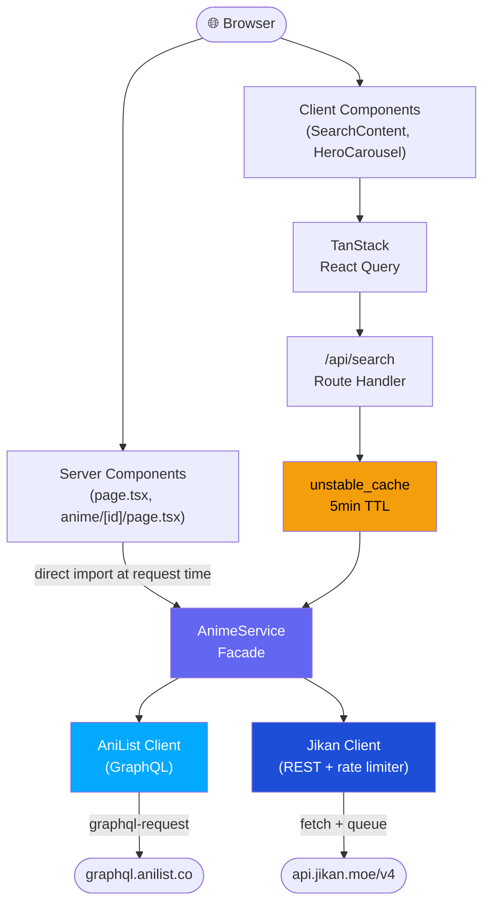
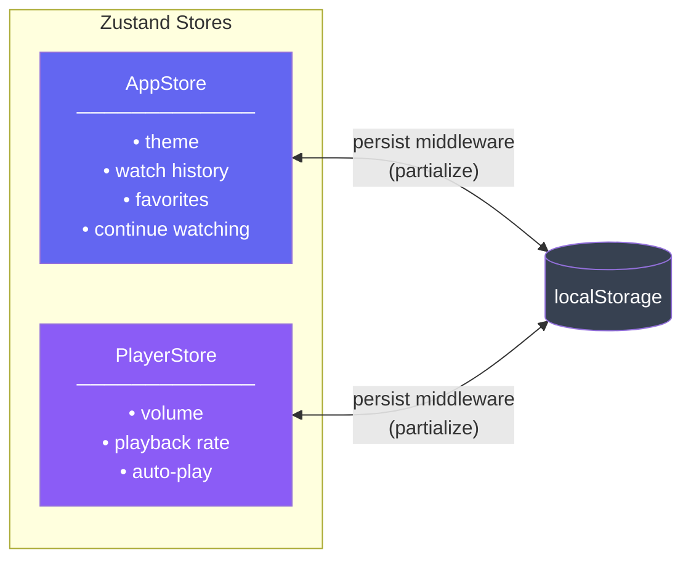

<div align="center">

# 🗾 Animap

**A full-stack anime discovery platform built on a Turborepo monorepo,  
powered by dual-provider API aggregation and a custom fuzzy search engine.**

[](https://www.typescriptlang.org/)
[](https://nextjs.org/)
[](https://turbo.build/)
[](https://pnpm.io/)
[](./LICENSE)

[](https://vercel.com)
[](./Dockerfile)
[](https://web.dev/progressive-web-apps/)
[](https://playwright.dev/)
[](https://eslint.org/)

[Overview](#overview) • [Features](#key-features) • [Architecture](#architecture--design) • [Getting Started](#getting-started) • [Roadmap](#roadmap--future-improvements)

</div>

---

## Overview

Animap aggregates data from **AniList** and **MyAnimeList (via Jikan)** into a single, unified discovery experience. Search, browse by genre, explore trending titles, and manage a personal watch history — all wrapped in a distinctive retro-terminal CRT aesthetic.

This project intentionally prioritizes the **discovery experience** — rich metadata, intelligent search, curated visual design — over video streaming.

> 🚀 **Live deployment**: Coming soon — configured for Vercel with `next-pwa` service worker support.

---

## Key Features

### 👤 User-Facing

| Feature | Description |
|---|---|
| 🔥 **Trending & Popular feeds** | Real-time AniList trending + popularity rankings on homepage |
| 🎠 **Hero carousel** | Auto-rotating featured anime with poster, metadata, and description cross-fades |
| 🔍 **Advanced search** | Full-text search with genre, format, status, sort filtering; URL-driven state |
| 🤔 **Fuzzy search + correction** | Handles misspellings, partial matches, romanization variants; "did you mean?" |
| 🏷️ **Genre browsing** | 22 genre categories with dedicated filtered views and pagination |
| 📺 **Anime detail pages** | Synopsis, studio credits, trailer, episode list, character grid, recommendations |
| 🌗 **Dark/Light theme** | Flash-prevention script + CSS variable-based design tokens |
| 📌 **Watch history & favorites** | Client-side state via Zustand + localStorage |
| 📱 **PWA** | Service worker, manifest, Workbox runtime caching |
| 📐 **Responsive design** | Mobile-first layout with Framer Motion animated navigation drawer |

### ⚙️ Technical

| Feature | Description |
|---|---|
| 🔀 **Dual-provider aggregation** | `AnimeService` façade routes to AniList (GraphQL) + Jikan (REST) |
| 🧠 **Custom fuzzy search pipeline** | Multi-variant expansion → Fuse.js weighted ranking → relevance scoring |
| ⚡ **Server-side caching** | `unstable_cache` with CDN `Cache-Control` headers (5min search, 2min suggest) |
| 🗄️ **Zustand state management** | `AppStore` + `PlayerStore` with `devtools` + `persist` middleware |
| 🎞️ **Framer Motion microinteractions** | `AnimatePresence` menu drawer, staggered links, icon morphs |
| 🖥️ **CRT terminal aesthetic** | CSS scanline overlays, `.geometric-box` card system, neon glow hover effects |
| 🐳 **Docker-ready** | Multi-stage `Dockerfile` with `turbo prune`, standalone output, non-root runner |

---

## Tech Stack

<div align="center">

| Layer | Technologies |
|---|---|
| **Language** | TypeScript 5.9 (strict) |
| **Framework** | Next.js 16.2 (App Router, React 19, Turbopack) |
| **Monorepo** | Turborepo + pnpm workspaces |
| **Styling** | Tailwind CSS 3.4 + CSS custom properties design system |
| **Animations** | Framer Motion 12 |
| **State Management** | Zustand 5 (devtools + persist middleware) |
| **Data Fetching** | TanStack React Query 5 (client), Server Components + `fetch` (server) |
| **API Clients** | `graphql-request` + `graphql-tag` (AniList), native `fetch` with rate limiter (Jikan) |
| **Search** | Fuse.js 7 (fuzzy full-text ranking) |
| **Icons** | Lucide React |
| **UI Primitives** | Radix UI (Dialog, Dropdown, Select, Tabs, Toast, Slider, Switch, etc.) |
| **PWA** | `next-pwa` (Workbox runtime caching) |
| **E2E Testing** | Playwright (Chromium, Firefox, WebKit) |
| **Linting** | ESLint 9 (flat config), Prettier, lint-staged + Husky pre-commit hooks |
| **Containerization** | Docker (multi-stage), Docker Compose |
| **Deployment** | Vercel (configured), standalone Next.js output |

</div>

---

## Architecture & Design

### 🏗️ Monorepo Structure

```
anitube/
├── apps/
│   └── Anitube/                    # Main Next.js 16 application
│       ├── app/                    # App Router pages and layouts
│       │   ├── api/search/         # Search and suggest API route handlers
│       │   ├── anime/[id]/         # Anime detail page (SSR)
│       │   ├── genre/              # Genre index and genre-filtered pages
│       │   ├── search/             # Advanced search page (client-side)
│       │   ├── watch/              # Watch redirect route
│       │   ├── layout.tsx          # Root layout with SEO, fonts, providers
│       │   └── globals.css         # Design system (CSS variables, scanlines)
│       ├── components/
│       │   ├── anime/              # Detail page components (Header, Episodes, Characters)
│       │   ├── home/               # Homepage components (Hero, AnimeCard, Section)
│       │   ├── layout/             # Header and Footer with Framer Motion
│       │   └── player/             # VideoPlayer with keyboard shortcuts
│       ├── lib/
│       │   ├── store/              # Zustand stores (app-store, player-store)
│       │   ├── query/              # React Query provider and client config
│       │   ├── search/             # Client-side search fetch utilities
│       │   └── constants.ts        # Application constants and route definitions
│       ├── e2e/                    # Playwright tests (home, search, layout, anime, nav)
│       └── playwright.config.ts    # E2E test configuration
├── packages/
│   ├── api/                        # @anitube/api — data access layer
│   │   └── src/
│   │       ├── providers/          # AniList (GraphQL) and Jikan (REST) clients
│   │       ├── search/             # Fuzzy search pipeline (normalize, rank, advanced)
│   │       ├── services/           # AnimeService unified facade
│   │       ├── types/              # Canonical and provider-specific type definitions
│   │       └── utils/              # Mappers and pagination helpers
│   ├── ui/                         # @anitube/ui — shared component library
│   ├── eslint-config/              # Shared ESLint configurations
│   └── typescript-config/          # Shared TSConfig base files
├── Dockerfile                      # Multi-stage production build
├── docker-compose.yml              # Container orchestration
├── turbo.json                      # Turborepo pipeline configuration
└── pnpm-workspace.yaml             # Workspace package definitions
```

### 🔄 Data Flow



### 🔍 Search Pipeline

```mermaid
flowchart LR
    Q(["User Query"])
    N["1. Normalize\nNFKC + strip punctuation"]
    V["2. Variant Generation\noriginal · stripped · no-spaces"]
    F["3. Fetch Candidates\n3× AniList searches"]
    D["4. Deduplicate\nby AniList ID"]
    R["5. Fuse.js Ranking\nEN 0.35 · romaji 0.30\nnative 0.25 · synonyms 0.20"]
    T["6. Threshold Filter\nscore ≥ 25/100"]
    C["7. Query Correction\nscore ≥ 55 → 'did you mean?'"]
    OUT(["Ranked Results"])

    Q --> N --> V --> F --> D --> R --> T --> C --> OUT

    style Q fill:#10b981,color:#fff
    style OUT fill:#10b981,color:#fff
    style R fill:#6366f1,color:#fff
    style C fill:#f59e0b,color:#000
```



### 🗂️ State Management



---

## 🎯 Project Highlights for Recruiters

> This section summarizes the engineering decisions that make this project non-trivial.

- **💪 Strong TypeScript proficiency** — strict typing throughout, discriminated unions for provider types, generic utility functions for mappers and pagination, typed GraphQL operations, and a well-defined public API surface with explicit exports.

- **🧠 Non-trivial search algorithm** — multi-variant query expansion, fuzzy full-text ranking with weighted fields, relevance scoring, and query correction. This is a custom search pipeline with real information retrieval concepts, not a simple API passthrough.

- **🧱 Clean architectural separation** — `@anitube/api` has zero coupling to React or Next.js. Provider clients, mappers, types, and search logic are independently testable behind a unified service interface.

- **🏭 Production patterns** — server-side caching with CDN headers, rate-limiting for the Jikan API, error boundaries with loading/error/not-found states per route, SEO metadata per page, flash-prevention for theme persistence.

- **📦 Monorepo competency** — Turborepo task graph with `dependsOn`, shared TypeScript and ESLint configs, workspace protocol dependencies, Docker with `turbo prune --docker`.

- **🎨 Cohesive design system** — CSS custom properties for theming, Tailwind extensions, reusable animation primitives (`.geometric-box`, `.neon-text`, `.animate-blink`), component-level Framer Motion patterns.

- **🧪 E2E test infrastructure** — Playwright tests organized by feature domain (home, search, navigation, anime details, layout) with auto-starting dev server configuration.

- **✅ Code quality enforcement** — ESLint flat config, Prettier, Husky pre-commit hooks running lint-staged, TypeScript strict mode across all packages.

---

## Getting Started

### Prerequisites

- **Node.js** ≥ 18
- **pnpm** 9.x (`corepack enable` to activate)
- **Docker** (optional, for containerized builds)

### Installation

```bash
# Clone the repository
git clone https://github.com/ArDnath/AniMap.git
cd AniMap

# Install dependencies
pnpm install

# Copy environment variables
cp apps/Anitube/.env.example apps/Anitube/.env.local
```

### Development

```bash
# Start all workspace packages in parallel (API + Next.js app)
pnpm dev
```

The app will be available at [http://localhost:3000](http://localhost:3000).

### Production Build

```bash
pnpm build
```

### 🐳 Docker

```bash
docker compose up --build
```

### Testing, Linting & Type Checking

```bash
pnpm test:e2e    # Playwright E2E tests
pnpm lint        # Lint all packages
pnpm check-types # TypeScript type check
pnpm format      # Prettier format
```

---

## Environment & Configuration

No API keys required — both AniList and Jikan are public APIs.

| Variable | Description | Default |
|---|---|---|
| `NEXT_PUBLIC_APP_URL` | Application base URL | `http://localhost:3000` |
| `NEXT_PUBLIC_API_URL` | Jikan API base URL | `https://api.jikan.moe/v4` |
| `NEXT_PUBLIC_ANILIST_API_URL` | AniList GraphQL endpoint | `https://graphql.anilist.co` |

**Quality-gate configuration files:**
- `tsconfig.json` — strict TypeScript across all packages with shared base configs
- `eslint.config.mjs` — ESLint 9 flat config with Next.js and React internal presets
- `.lintstagedrc.js` — runs ESLint fix and Prettier on staged files
- `.husky/pre-commit` — gates all commits through lint-staged

---

## Implementation Details & Trade-offs

<details>
<summary><strong>⏱️ Rate Limiting (Jikan Client)</strong></summary>

The Jikan API enforces ~3 requests/second. `JikanClient` implements a queue-based rate limiter using promise chaining (`this.chain`), serializing requests with a minimum interval. This avoids 429 responses without external libraries.

</details>

<details>
<summary><strong>📊 Search Relevance Scoring</strong></summary>

Fuse.js scores (0 = perfect, 1 = no match) are converted to a 0–100 relevance scale. Results below 25 are filtered. When fewer than 5 results pass the threshold, unmatched candidates are appended with a baseline score of 10 and flagged as fuzzy matches.

</details>

<details>
<summary><strong>🌗 Theme Flash Prevention</strong></summary>

A blocking `<script>` in `<head>` reads `localStorage` before React hydrates and adds the `.light` class immediately — preventing the dark-to-light flash common in client-side theme implementations.

</details>

<details>
<summary><strong>🔀 Provider Abstraction</strong></summary>

`AnimeService` routes calls to the right provider: AniList for metadata-heavy queries (details, search, trending, genre) and Jikan for MAL-specific data (episodes, recommendations, top rankings). Each API's strengths are fully leveraged.

</details>

<details>
<summary><strong>🎯 Deliberate Simplifications</strong></summary>

- **No authentication** — discovery platform; watch history/favorites are client-side only.
- **No database** — all data from external APIs; persistence via Zustand + localStorage.
- **Video player is a demo** — fully functional (keyboard shortcuts, seek, volume, playback speed, fullscreen) but uses a sample URL since this is a discovery platform, not a streaming service.

</details>

---

## Roadmap / Future Improvements

- [ ] **Unit and integration tests** — Vitest tests for `@anitube/api` search pipeline, mappers, and service layer
- [ ] **CI pipeline** — GitHub Actions for lint, type-check, build, and Playwright E2E on push/PR
- [ ] **Accessibility audit** — ARIA landmarks, focus management, reduced-motion queries, screen reader testing
- [ ] **Search suggestions UI** — wire `/api/search/suggest` to a typeahead dropdown in the header
- [ ] **Infinite scroll** — replace pagination with intersection-observer-based infinite loading
- [ ] **Image optimization** — `loading="eager"` and `priority` on above-the-fold hero images
- [ ] **Error monitoring** — integrate Sentry for production error tracking
- [ ] **Analytics** — GA and Vercel Analytics (env placeholders already exist)

---

## Contributing

Contributions are welcome!

```bash
# Fork and clone
git clone https://github.com/<your-username>/AniMap.git
cd AniMap

# Create a feature branch
git checkout -b feat/your-feature

# Install and validate
pnpm install
pnpm lint && pnpm check-types && pnpm build

# Commit (Husky runs lint-staged automatically)
git commit -m "feat: description of change"

# Open a Pull Request
```

---

## License

This project is licensed under the **GNU Affero General Public License v3.0 (AGPL-3.0)**. See the [LICENSE](./LICENSE) file for full terms.

---

<div align="center">

**Built by [Ariyaman Debnath](https://github.com/ArDnath)**

[](https://github.com/ArDnath)
[](mailto:ariyamandebnath.ad@gmail.com)

</div>
